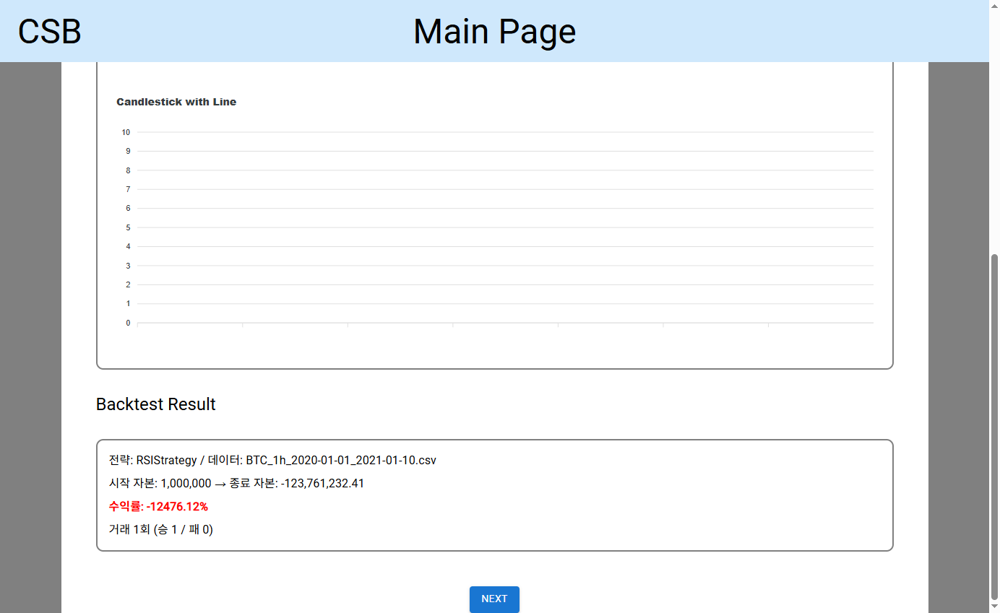

# PCBS

> 코인 백테스트·드라이런 시스템. Python 백엔드(`CBS/`)와 React 대시보드(`front/`). 2024-05~06, 졸업작품.

## 무엇인가

Binance 캔들을 수집해 backtrader로 전략을 백테스트하고, 그 결과를 React 대시보드에서 보는 시스템이다. 프론트 개발이 막혀 메인 페이지 단계에서 중단했고, 이후 코인 트레이딩 작업은 CLI·텔레그램 방향으로 전환했다.

## 구성

**백엔드 — `CBS/`**
- `Request/Collecter.py` — Binance에서 캔들 수집 (ccxt, ThreadPoolExecutor 병렬)
- `Request/ProcessData.py`, `SellectSimbol.py` — 데이터 정제·심볼 선별
- `Trade/main.py` — backtrader 백테스트 러너. 전략 파라미터는 `stategy.json`으로 주입
- `Util/News.py` — 뉴스 크롤러
- `Data/` — BTC/ETH 캔들 CSV 샘플

**프론트 — `front/`** (React + MUI + ApexCharts)
- `MainPage` / `IntroPage` — 진입 화면
- `BacktestPage` / `DryrunPage` / `ResultPage` — 백테스트 설정·실행·결과 차트
- `ConfigPage`, `Option/` — 기간·심볼·전략 파라미터 입력 컴포넌트
- `MainNewsPage`, `Action/NewsCollecter` — 뉴스 수집 뷰

## 실행

백엔드 (Python 3.13, 저장소 루트에서):

```bash
pip install flask flask-cors backtrader pandas matplotlib ccxt requests beautifulsoup4
python -m CBS.app                # Flask :5000
```

프론트 (Node 18+):

```bash
cd front
npm install
npm start                        # CRA dev server :3000 → /MainPage
```

CLI 백테스트만 돌리려면: `python CBS/Trade/main.py` (성과 dict 출력 + 캔들차트)

## 결과



2026-07-09 통합 실행 — `/api/backtest`가 RSIStrategy·BTC 1h CSV(2020~) 백테스트를 돌려 수익률 -12476.12%·거래 1회를 JSON으로 반환하고, 메인 페이지가 이를 표시한다. 성과 수치는 2024년 원본 전략 로직 그대로의 출력이다(전략 로직은 동결 — 수치 타당성 검증은 범위 밖). 상세: [docs/실행증거_2026-07-09.md](docs/실행증거_2026-07-09.md).

## 상태

프론트 메인 페이지 단계에서 중단. 백테스트 경로는 동작 확인됨 (RSIStrategy, 포함된 BTC 1h CSV 기준). 이 경험이 이후 봇들을 웹 UI 대신 CLI·텔레그램 인터페이스로 설계한 계기가 됐다.

2026-07 마무리: 중단 지점이었던 프론트를 완성 — 빌드 브레이커(누락 이미지·절대경로 import) 수정, `/api/backtest` 무한재귀를 `run_backtest()` 연결로 교체, 메인 페이지에 결과 표시. 드라이런 API는 미구현으로 남김(501 응답). CLI 차트는 backtrader 1.9와 신형 matplotlib 비호환으로 미제공.
